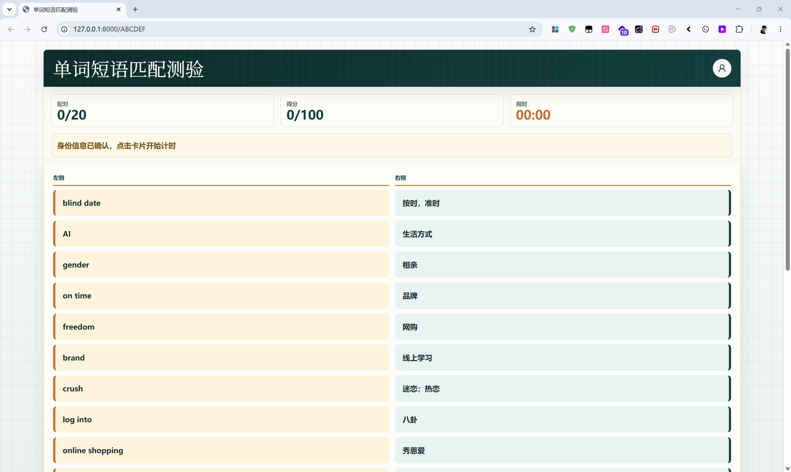
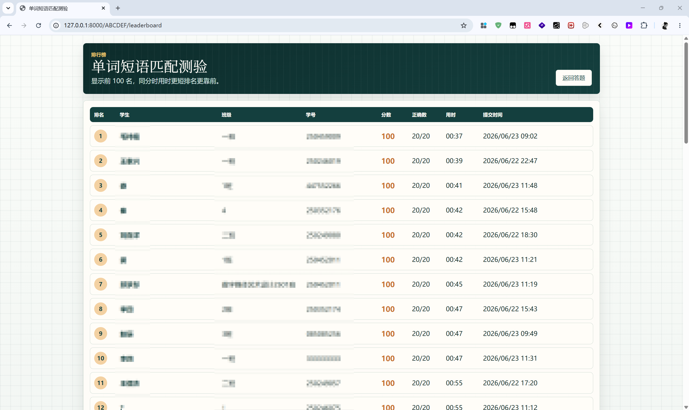
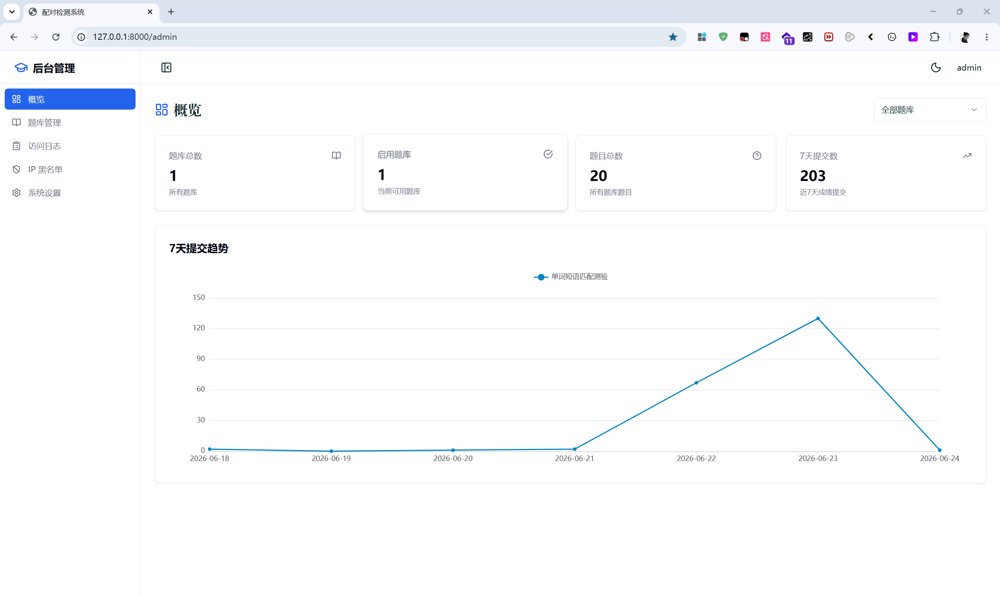

# 多题库配对测验系统

这是 FastAPI + React + MySQL 的配对题库系统，支持后台管理题库、题目、默认跳转题库、排行榜记录和公开访问记录。

## 预览展示







## 环境准备

安装 Python 依赖：

```bash
pip install -r requirements.txt
```

复制 `.env.example` 为 `.env`，填写数据库和后台管理员配置：

```bash
# 网站标题（浏览器标签页标题）
SITE_TITLE=配对检测系统
# 后台侧边栏顶部标题文案
ADMIN_SIDEBAR_TITLE=后台管理
MYSQL_HOST=127.0.0.1
MYSQL_PORT=3306
MYSQL_USER=root
MYSQL_PASSWORD=your_password
MYSQL_DATABASE=quiz_db
MYSQL_CHARSET=utf8mb4
MYSQL_COLLATION=utf8mb4_unicode_ci
ADMIN_USERNAME=admin
ADMIN_PASSWORD=change_me
ADMIN_SESSION_SECRET=replace_with_a_long_random_secret
ADMIN_COOKIE_SECURE=false
IP2REGION_XDB_PATH=
```

`ADMIN_SESSION_SECRET` 至少需要 32 个字符。生产环境使用 HTTPS 时建议将 `ADMIN_COOKIE_SECURE` 设置为 `true`；本地 HTTP 开发保持 `false`。

`IP2REGION_XDB_PATH` 是可选项。配置 IPv4 xdb 文件后，访问记录会用 `ip2region` 解析 IP 地理位置；未配置或解析失败时会记录为“未知”。

## 后端运行

```bash
uvicorn main:app --reload
```

应用启动时会自动创建目标数据库、缺失的数据表，并同步模型中新增或变更的字段、索引和唯一约束。数据库中模型未声明的历史字段会保留，不会自动删除。

## 前端运行

```bash
cd frontend
npm install
npm run dev
```

开发服务器默认通过 Vite 代理访问 `http://127.0.0.1:8000/api`。

## 构建并由 FastAPI 托管

```bash
cd frontend
npm run build
cd ..
uvicorn main:app --reload
```

构建产物会输出到 `static/`。FastAPI 会托管 React 页面，并在主域名已配置默认题库时跳转到 `/{slug}`。

## 使用入口

- 后台管理：`/admin`
- 题库公开链接：`/{slug}`
- 题库排行榜：`/{slug}/leaderboard`

首次部署后先进入后台创建题库，并设置默认题库。题库支持独立链接、启停、排行榜显示名额和内置提交页样式。

## 验证

```bash
pytest
cd frontend
npm run lint
npm run typecheck
npm run build
```

测试会通过 `create_app(database_url=...)` 使用临时 SQLite 数据库，不依赖本地 MySQL 服务。
